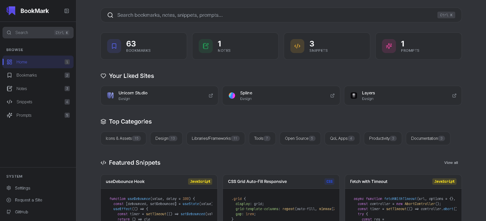

<div align="center">
  

  # BookMark

  **An open-source, curated directory of developer bookmarks, notes, code snippets, and AI prompts.**
  No login required. Browse, search, and save your own items locally.

  [](LICENSE)
  []()
  []()

</div>

---

## What Is This?

BookMark is a static single-page app that serves as a personal developer resource directory:

- **Bookmarks** — Curated links organized by category with search, filters, and auto-detected favicons
- **Notes** — Rich-text notes with a `contenteditable` editor, color accents, and auto-save
- **Snippets** — Code blocks with syntax highlighting (16 languages), copy-to-clipboard, and a full viewer panel
- **Prompts** — AI/text prompt library organized by category with a full viewer panel
- **Settings** — Manage all locally saved data with granular clear controls and a safe "Restore to Default" flow

All curated data lives in plain JSON files. User-created items (bookmarks, notes, snippets, prompts) are saved to **localStorage** — no database, no authentication, no server-side code.

---

## Tech Stack

| Layer            | Technology                              |
| ---------------- | --------------------------------------- |
| Frontend         | Vanilla JavaScript (ES6+), Custom CSS   |
| Data (curated)   | Static JSON files (`data/*.json`)       |
| Data (user)      | Browser localStorage                    |
| Icons            | Lucide Icons (CDN, pinned v0.460.0)     |
| Fonts            | Inter + JetBrains Mono (Google Fonts)   |
| Syntax Highlight | highlight.js 11.9.0                     |

**No build tools. No npm. No frameworks. No database.** Pure static files.

---

## Project Structure

```
BookMark/
├── index.html                Single-page app shell
├── data/
│   ├── bookmarks.json        Curated bookmarks
│   ├── notes.json            Curated notes
│   ├── snippets.json         Curated code snippets
│   └── prompts.json          Curated AI prompts
├── assets/
│   └── icons/
│       └── logo.png          App logo
├── css/
│   ├── index.css             Design tokens, reset, layout, responsive
│   ├── sidebar.css           Desktop sidebar + mobile bottom nav
│   ├── command-palette.css   Ctrl+K search overlay
│   ├── dashboard.css         Home page styles
│   ├── links.css             Bookmark cards, filters
│   ├── notes.css             Note cards, rich editor, viewer
│   ├── snippets.css          Code cards, syntax highlighting, viewer
│   ├── prompts.css           Prompt cards, categories, viewer
│   └── settings.css          Settings page
└── js/
    ├── store.js              Data layer — JSON fetch + localStorage CRUD
    ├── app.js                Hash router, toasts, confirm modal, utilities
    ├── sidebar.js            Desktop sidebar + mobile bottom nav
    ├── command-palette.js    Ctrl+K global search
    ├── dashboard.js          Home/overview page
    ├── links.js              Bookmark browser + add/edit modal
    ├── notes.js              Notes viewer + rich text editor
    ├── snippets.js           Code snippet viewer + add/edit modal
    ├── prompts.js            Prompt library + add/edit modal
    └── settings.js           Settings page — data management
```

---

## Adding Curated Data

Edit the JSON files in `data/` directly. Any new `category` value you add will automatically appear in the filter bar and add/edit modal dropdowns — no code changes needed.

### Bookmark (`data/bookmarks.json`)

```json
{
  "id": "https://example.com/",
  "url": "https://example.com/",
  "title": "Example Site",
  "category": "Development",
  "tags": ["javascript", "tools"],
  "notes": "Why this site is useful",
  "favicon": "https://www.google.com/s2/favicons?domain=example.com&sz=32",
  "createdAt": "2025-01-01T00:00:00Z"
}
```

> **Note:** `id` must equal `url` (exact string match). This is how the likes system keys items.

### Note (`data/notes.json`)

```json
{
  "id": "1",
  "title": "Note Title",
  "body": "<p>HTML content here</p>",
  "color": "#5865f2",
  "linkedBookmarks": [],
  "createdAt": "2025-01-01T00:00:00Z",
  "updatedAt": "2025-01-01T00:00:00Z"
}
```

> `updatedAt` is used for sort order ("newest" sorts by last modified). Always set it.

### Snippet (`data/snippets.json`)

```json
{
  "id": "1",
  "title": "Snippet Title",
  "language": "JavaScript",
  "code": "console.log('hello');",
  "tags": ["javascript", "logging"],
  "createdAt": "2025-01-01T00:00:00Z"
}
```

### Prompt (`data/prompts.json`)

```json
{
  "id": "1",
  "title": "Prompt Title",
  "category": "Coding",
  "body": "You are a helpful assistant that...",
  "tags": ["coding", "system-prompt"],
  "createdAt": "2025-01-01T00:00:00Z"
}
```

---

## User-Created Items

Visitors can add their own bookmarks, notes, snippets, and prompts directly in the UI. These are stored in **browser localStorage** under the keys `user_bookmarks`, `user_notes`, `user_snippets`, `user_prompts`.

User items are visually marked with a **Local** badge and have Edit/Delete controls. They are merged with the curated JSON data at render time and appear together in lists and search.

**Clearing localStorage** (via the Settings page or browser devtools) removes user items. The curated JSON data is unaffected.

---

## Run Locally

```bash
# Python (built-in)
python -m http.server 8000

# Node (npx)
npx serve .

# VS Code — Live Server extension works fine
```

Then open `http://localhost:8000`.

> Opening `index.html` directly via `file://` will not work because `fetch()` requires HTTP.

---

## Deploy

Static site — deploy anywhere:

- **GitHub Pages** — push to a `gh-pages` branch or configure Pages on `main`
- **Netlify / Vercel** — connect repo, no build command, publish directory: `.`
- **Any web server** — upload the folder as-is

---

## Features

| Feature | Description |
|---|---|
| **Ctrl+K search** | Command palette searches across all data types simultaneously |
| **Category filters** | Filter pills on bookmarks; language filter on snippets; category filter on prompts |
| **Side-panel viewer** | Full-content viewer for notes, snippets, and prompts — no truncation |
| **Rich note editor** | `contenteditable` with Bold, Italic, Heading, Lists, Blockquote, Code block; auto-saves after 600ms |
| **Add/Edit modals** | Create and edit your own bookmarks, snippets, and prompts via forms |
| **Custom categories** | Type a new category name in any modal — it persists to localStorage and appears in all dropdowns |
| **Duplicate URL warning** | Detects and surfaces duplicate bookmark URLs on the Bookmarks page |
| **Inline bookmark notes** | Click the note area on any bookmark card to write/edit a note, saved locally |
| **Likes** | Heart any item — liked items persist in localStorage and float to the top with "Liked first" sort |
| **Settings page** | Granular data clearing (likes, inline notes, added items, categories) + full "Restore to Default" with confirmation phrase |
| **Mobile FAB** | Floating action button on mobile for quick item creation |

---

## Keyboard Shortcuts

| Shortcut | Action |
|---|---|
| `Ctrl+K` | Open command palette |
| `1` – `6` | Navigate to each page (Home, Bookmarks, Notes, Snippets, Prompts, Settings) |
| `Escape` | Close palette / confirm modal |

---

## Contributing

Want to suggest a bookmark or resource? Click **Request a Site** in the sidebar to open a GitHub Issue form.

Pull requests are welcome for new curated items in `data/*.json`.

---

## License

MIT
